# 당근나라 소개

> 온 국민이 알고 있는 중고 거래 사이트이며, 동네 정보까지 나눠 이웃과 가깝고 따뜻한 온기를 나눌 수 있는 어플리케이션 입니다.

### 개발 인원 및 기간

> 개발 기간: 2022-04-18 ~ 2022-04-29
> 
> 개발 인원: 프론트 4명, 백엔드 1명
> 
> [백엔드 github 링크](https://github.com/wecode-bootcamp-korea/justcode-4-2nd-carrot-country-back)

### 프로젝트 선정 이유

> 2주라는 짧은 기간 안에 복잡한 데이터베이스와, 어려운 기능보다는 프론트, 백엔드 포지션 모두가 만족할 수 있는 기본에 충실한 웹 사이트로 클린한 코드와 지금까지 배웠던 기술들을 잘 녹여낼 수 있는 프로젝트라 생각합니다.

### 데모 이미지

> 메인화면

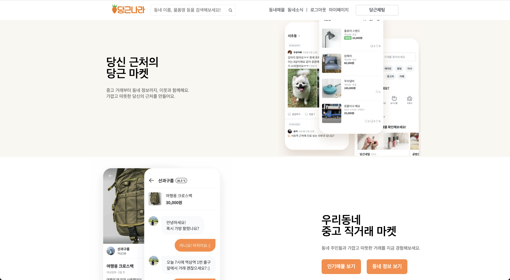

> 로그인

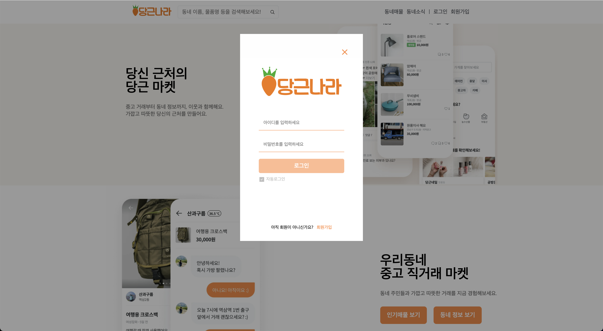

> 회원가입

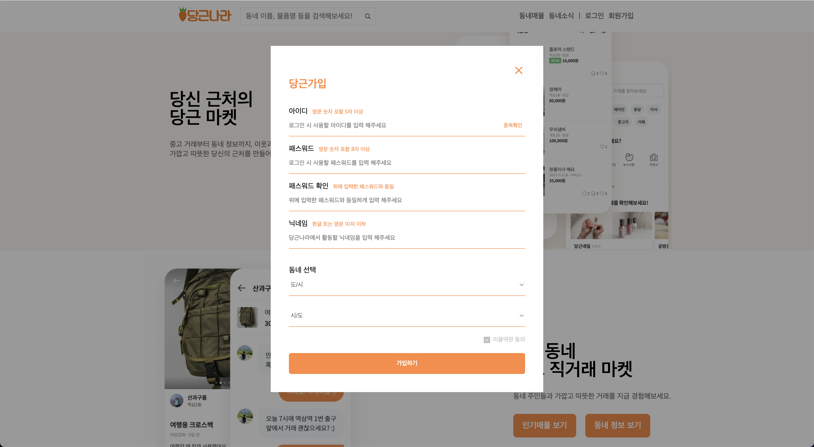

> 매물 리스트

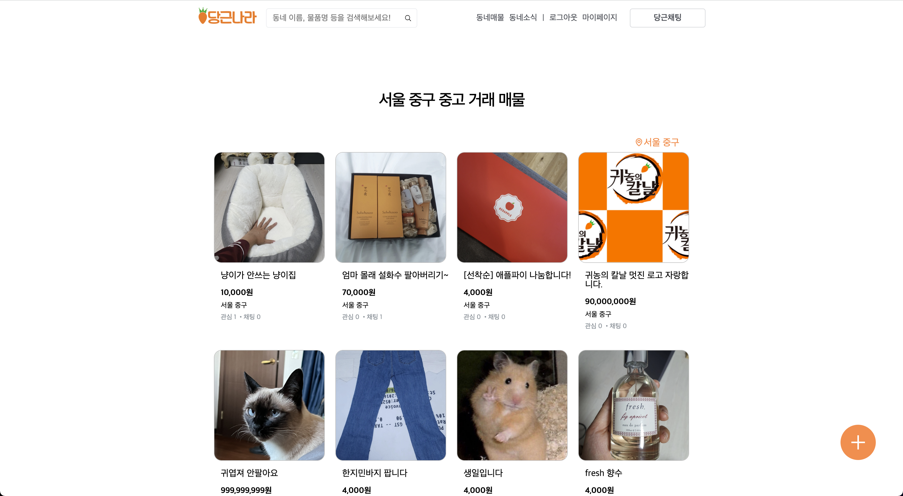

> 매물 상세보기

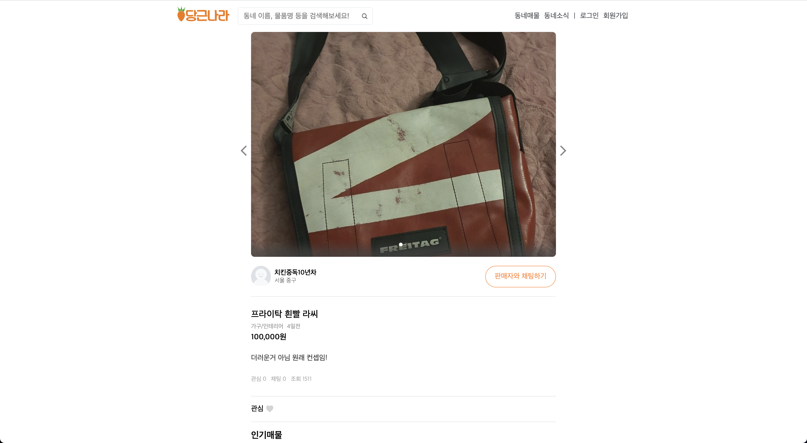

> 매물 등록

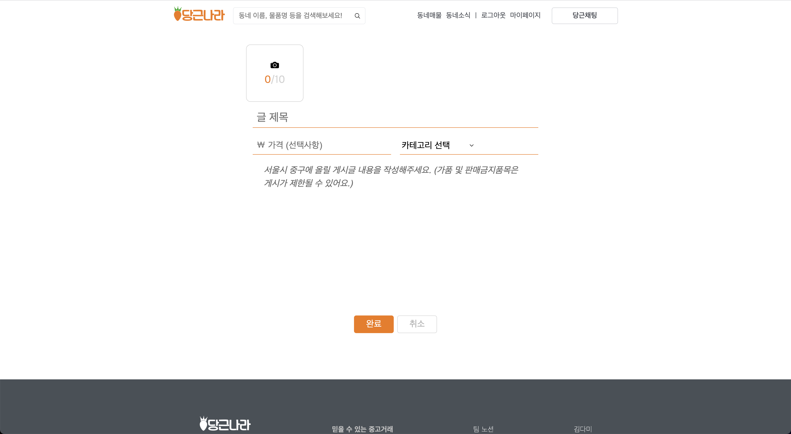

> 동네소식 리스트

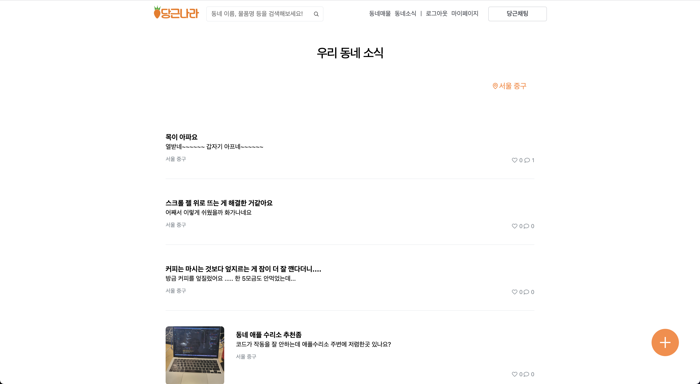

> 동네소식 상세보기

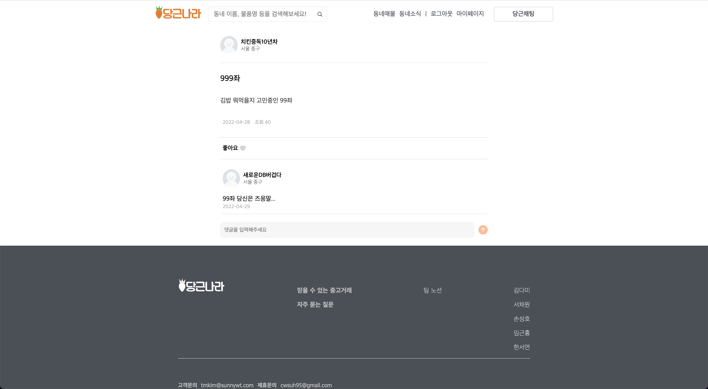

> 동네소식 등록

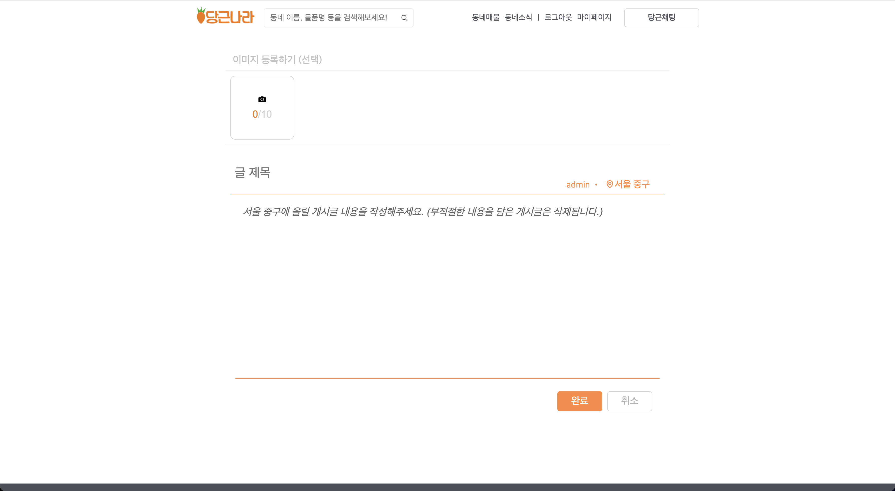

> 매물/동네정보 검색 리스트

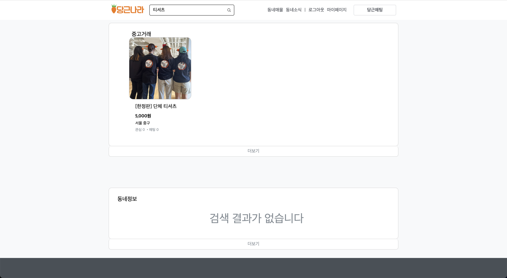

> 채팅

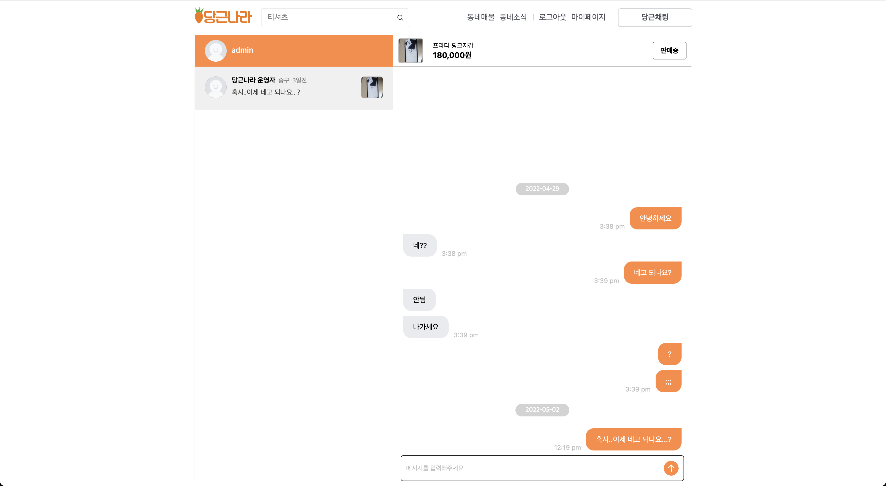

# 적용 기술 및 구현 기능

### 적용 기술

> 프론트엔드 : React, styled-comonpents, Context API, socket.io-client, jest
>
> 백엔드 : Node.js, Express.js, MySQL, bcrypt, jsonwebtoken, prisma, multer, socket.io
>
> 공통 : RESTful API, MVC Pattern, Github, Slack, Notion

### 구현 기능

**메인화면**

- 인기매물 보러가기, 동네정보 보러가기

**회원가입**

- 중복아이디 확인
- 패스워드 일치 확인
- 동네선택

**매물 상세정보**

- 판매자와 채팅하기
- 매물 이미지 클릭 시 원본 보기
- 하단 다른 매물 리스트 컴포넌트 제공
- 관심 기능
- 조획 기능

**채팅 리스트**

- 최신순으로 정렬
- 마지막 대화 표시

**채팅 룸**

- 중복되는 시간 표시 제거
- 날짜별로 라인 표시
